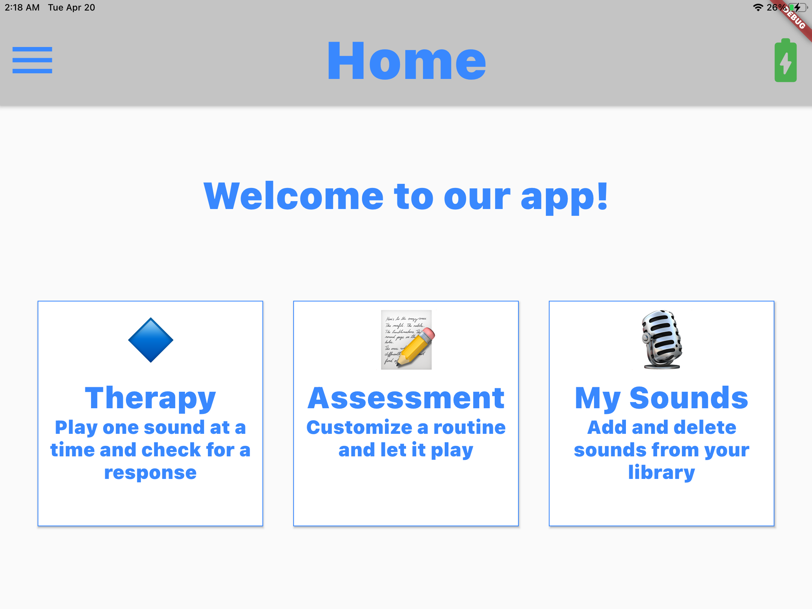

# Auditory Testing System for Minimally Conscious Patients (BME 460L) 

Created by Abhi Jadhav on 3/21/2021.

Copyright © 2021 Abhi Jadhav, Nathan Parikh, Aayush Goradia. All rights reserved.

Domain: abhijadhav.me

### Install Instructions: 
https://flutter.dev/docs/get-started/install

### Screenshots 
Home Screen

